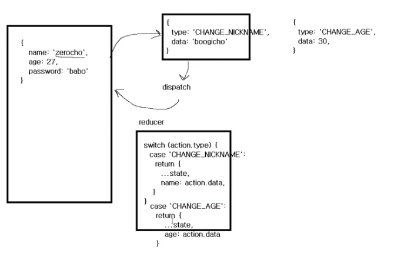

## redux 설치

리덕스에서는 _app.js내에서 provider로 감싸지만 nextjs의 리덕스는 생략한다.

리덕스를 사용하는 이유
1. 기존에는 부모컴포넌트에서 로그인 정보를 가지고 뿌려주는 역할을 하는데
   리덕스에서는 중앙데이터 저장소를 만들어 로그인 정보를 가지고 있는다.
2. 규모가 있는 서비스는 리덕스! 초보를 탈출하면 mobX
3. 리덕스를 쓴다면 에러를 추적하기 쉬움

비동기 3단계 절차
요청 , 성공, 실패
contextapi의 경우 useEffect 의 then catch를 사용하여 요청 성공 실패를 하지만
이건 라이브러리에서 해결해야 한다고 생각한다.

데이터는 훅이나 라이브러리를 사용하여 받아오고 화면을 그리는 것만 해야한다?

## 리덕스의 원리
- 데이터를 변경해야 한다면 action을 만들어야 한다.

- 액션 하나하나 기록이 되기 때문에 오류찾기가 빠르다.
- 데이터를 하나씩 되돌릴수 있다.

- 단 코드의 양이 많아진다.(switch문, state문)

- 자바스크립트의 불변성
```js
{} === {} // false // 만들때 마다 새로운 객체 

const a = {}
const b = a
a === b // true // 객체 복사
 

```
- 객체를 새로 만들어야 변경및 추적이 가능하다.

- ...state의 경우에는 고정되어있는 참조는 메모리의 효율적인 정리를 위해 사용

#### reducer(리듀서)
// redux devtools- extention 브라우저와 연동

(이전상태,액션) => 다음상태  (두개를 받아서 한개로 축소)

액션을 기록하고 싶다면 미들웨어를 넣어야 한다.
개발용미들웨어 !== 배포용미들웨어